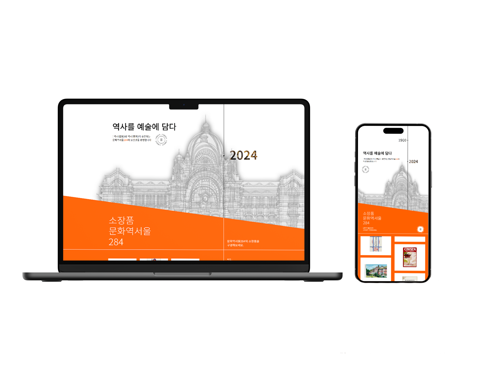

# 🏫 문화역서울 284 Website Renewal

## 🚠 About

+ <b>제작기간: 2024/04/15 ~ 2024/06/02

+ <b>참여인원(3명) : 문정해,신현호,이성민

## 🚠 문화역서울284 선택 이유 & 개선방향

+ **디자인 레이아웃 개선**  
  + 문화역서울284의 기존 페이지들은 디자인 레이아웃이 단순하며, 필요한 정보에 접근하기 위해 여러 번 클릭해야 하는 불편함이 있었습니다. 이러한 점들을 개선하고자 보다 직관적이고 ui/ux 개선을 목표로 이 프로젝트를 선정하게 되었습니다
   
+ **JavaScript를 활용한 동적 애니메이션**  
  + 자바스크립트를 활용하여 동적인 애니메이션 구현과 상호작용적인 기능들을 구현해서 사용자가 풍부하게 경험할 수 있도록 노력했습니다.

+ **상호작용적 기능 추가**  
  + 사용자와의 상호작용을 촉진하기 위해 다양한 기능을 추가하여 페이지의 사용성을 향상시켰습니다.

+ **다양한 전시와 행사 정보 강조**  
  + 문화역서울284의 장점인 다채로운 전시와 행사 정보를 강조하고 시각적으로 두드러지게 표현하여 사용자들에게 즉각적으로 전달했습니다.

+ **SNS 통합 마케팅 강화**  
  + 마케팅 부문 강화를 위해 하단 섹션에 SNS 연동을 추가하여 사용자들이 소셜 플랫폼에서도 쉽게 문화역서울284의 소식을 접할 수 있도록 했습니다.

## 🚠 디자인 전략

### 🚂 목적

1. 직관적인 정보 전달을 위해 인터페이스(UI) 개선
2. 그림과 사진 다양성을 통한 시각적 요소 강화
3. 애니메이션 효과로 사용자 경험(UX) 향상

### 🚂 Concept

주황색을 메인 컬러로 활용하여 선을 다수 사용하여 역의 기찻길을 표현했습니다.
어떤 홈페이지인지 알기 쉽게 글씨를 간결하게하고, 그림을 다수 활용하여 직관적인 시각적 효과를 주었으며 
전시하는 느낌을 주기위해 앞에서부터 뒤로의 배치를 채택했습니다.

### 🚂 Color

프로젝트의 컬러 팔레트는 
기존의 주황색을 유지하면서, 주황색의 강렬함을 활용해 시선을 사로잡고, 
이에 더해 유채색을 포인트 컬러로 추가함으로써 종합 전시관의 다채롭고 활기찬 분위기를 강조했습니다.

## 🚠 페이지의 구성과 동작

### <스크롤 이벤트와 반응형 웹 디자인을 활용한 애니메이션 효과 구현하기>

`main-intro section`이 브라우저 창에 나타나기 시작할 때를 감지하여 수직 스크롤바의 위치가 `main-intro`가 나타나기 시작하는 위치보다 값이 클 때 애니메이션이 실행되도록 하였습니다.
또한 모바일과 pc의 공통적인 부분과 그렇지 않은 부분을 나누어 작성하였으며, 애니메이션에 delay를 주어 순서에 맞게 자연스럽게 실행되도록 하였습니다.     

### <html()를 활용하여 콘텐츠를 동적으로 작성하기>

브라우저 창의 크기에 따라 html()을 이용하여 줄바꿈 위치를 변경하였습니다.
또한 `$(window).resize()`를 사용하여 브라우저 창의 크기가 변경될 때마다 `updateCollectionTxt()`를 호출하여 `html()` 안의 내용을 실시간으로 업데이트함으로써 화면 크기에 따라 최적화된 사용자 경험을 얻을 수 있게 하였습니다.

### <스크롤 위치에 따른 초기화 및 애니메이션 실행하기>

수직 스크롤 위치가 `exhibition-title`가 보이지 않는 영역에 있을 때 초기화 애니메이션을 실행하고, 그렇지 않을 경우 `animateScroll()` 함수를 호출하여 부드럽게 나타나는 애니메이션을 실행되게 하였습니다. 이렇게 함으로써 사용자가 페이지를 스크롤 함에 따라 요소들이 자연스럽게 나타나거나 사라지도록 구현하였습니다.

### <화면 너비에 따라 콘텐츠 박스 위치 변경하기>

`insertBefore(), insertAfter(), append()` 등과 같은 메서드를 활용하여 화면 너비에 따라 콘텐츠 박스의 위치를 조정하여 레이아웃을 변경하였습니다.

해당 `section` 내에서 `scrollTop()`의 위치에 따라 요소들이 수직으로 부드럽게 이동하는 애니메이션을 구현하였습니다. 또한 모바일 환경에서는 화면 크기에 따라 적합한 애니메이션을 제공하도록 자바스크립트 코드를 동적으로 변화시켰습니다.
